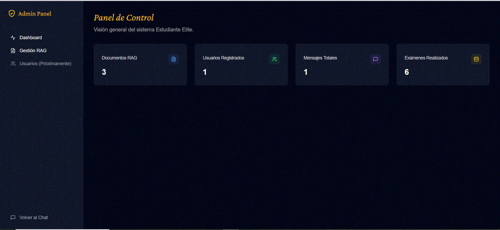
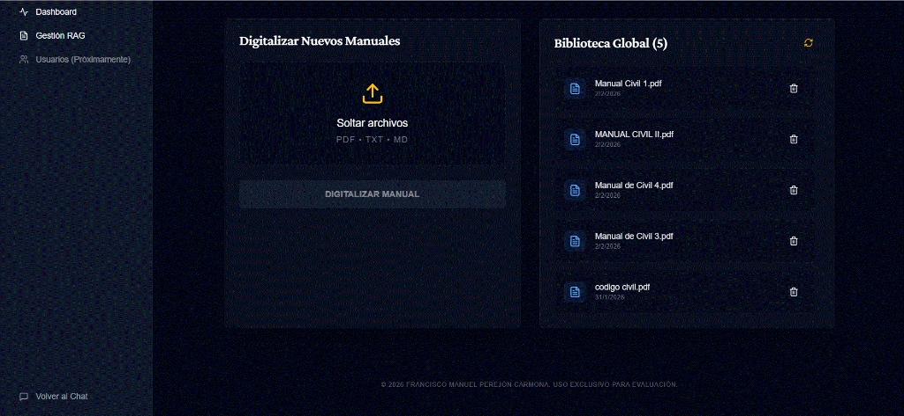

# Estudiante Elite (LexTutor Agent)

Plataforma avanzada de tutoría jurídica con Inteligencia Artificial (RAG), diseñada para estudiantes de Derecho en España. (mobile responsive)

## 🏗 Stack Tecnológico

- **Frontend**: Next.js 14 (App Router) + React + TailwindCSS + Shadcn/UI
- **Backend**: Next.js API Routes (Serverless Functions)
- **Base de Datos & Auth**: Supabase (PostgreSQL, Row Level Security, Auth, Storage)
- **IA & RAG**: Arquitectura Dual Cloud (Google Gemini + OpenAI)

---

## 🛠️ Herramientas de Desarrollo

Este proyecto fue desarrollado con el apoyo de **Antigravity** (Google Gemini Code Assist), una herramienta avanzada de asistencia de código basada en IA que aceleró significativamente el proceso de implementación, debugging y optimización del sistema.

**Características de Antigravity utilizadas**:
- Generación de código TypeScript/React con análisis contextual profundo
- Refactoring automatizado y optimización de arquitectura
- Debugging asistido con análisis de logs y stack traces
- Integración con APIs de Google Cloud y OpenAI
- Documentación técnica y generación de tests

---

## 🧠 Arquitectura de IA: Multi-Modelo Híbrido

El sistema implementa una capa de abstracción (`src/lib/ai-service.ts`) que orquesta **4 modelos diferentes** según la tarea, optimizando coste/latencia/precisión:

### Routing Automático por Operación

```
┌─────────────────────────┬────────────────────────────────────┐
│ Operación               │ Modelo Utilizado                   │
├─────────────────────────┼────────────────────────────────────┤
│ Chat conversacional     │ GPT-5.2 o Gemini 1.5 Flash         │
│ Quiz (test múltiple)    │ GPT-4o o Gemini 1.5 (JSON mode)    │
│ Exam (desarrollo)       │ GPT-4o o Gemini 1.5 (JSON mode)    │
│ Grading (corrección)    │ Gemini 2.0 Flash                   │
│ Audio (mensajes voz)    │ Gemini 1.5 (único viable)          │
└─────────────────────────┴────────────────────────────────────┘
```

**Variable de control**: `AI_PROVIDER=gemini` o `openai` en `.env.local`

### ¿Por qué Dual Cloud RAG?

**Requisito técnico**: "Usar Google File Search Y ChatGPT"

**Problema**: Son ecosistemas separados sin interoperabilidad

  - OpenAI NO puede acceder a Google File Search
- Google File Search NO puede usarse con OpenAI

**Solución**: Ingesta doble simultánea en `/api/upload`
```typescript
// Cuando un admin sube un archivo:
1. Sube a Google File Search → Para use con Gemini
2. Sube a OpenAI Vector Store → Para uso con GPT-5.2/GPT-4o
3. Registra ambos IDs en Supabase (tabla `rag_documents`)
```

---

## 💰 Debug & Observabilidad

### 🤖 Identificación de Modelo en Logs

Todos los logs de servidor incluyen el prefijo `🤖 [MODELO]` para visibilidad total:

```bash
🤖 [MODELO] Chat conversacional → GPT-5.2 (Responses API)
🟣 Calling GPT-5.2 Responses API...
✅ GPT-5.2 Response received
```

### 💵 Control de Costes (Token Usage)

Cada operación IA emite logs financieros en tiempo real:

```bash
💰 [GPT-5.2] Token Usage:
   📥 Input:  5,201 tokens (€0.009778)
   📤 Output: 1,155 tokens (€0.008686)
   📊 Total:  6,356 tokens (€0.018463)
   💵 Costo estimado: €0.018463 EUR
```

### Ejemplos de Debug por Operación

#### 1. Generación de Examen (Quiz)
```bash
🤖 [MODELO] Generación Quiz → Gemini 1.5 Flash (generateContent API + File Search)

💰 [GEMINI] Token Usage:
   📥 Input:  3,245 tokens (€0.000230)
   📤 Output: 892 tokens (€0.000251)
   📊 Total:  4,137 tokens (€0.000481)
   💵 Costo estimado: €0.000481 EUR
   
🔍 RAG: 5 documentos recuperados (Derecho Civil - Tema 3.pdf, Código Civil Arts. 1-100.pdf...)
```

#### 2. Evaluación de Examen (Grading)
```bash
🤖 [MODELO] Grading Exam → GPT-4o (Chat Completions API)

💰 [OPENAI] Token Usage:
   📥 Input:  8,102 tokens (€0.001139)
   📤 Output: 456 tokens (€0.000257)
   📊 Total:  8,558 tokens (€0.001396)
   💵 Costo estimado: €0.001396 EUR

📝 Rúbrica aplicada: Exactitud (4 pts), Razonamiento (3 pts), Claridad (2 pts)
✅ Calificación final: 7.5/10
```

#### 3. Chat Conversacional (GPT-5.2 con reasoning)
```bash
🤖 [MODELO] Chat conversacional → GPT-5.2 (Responses API)
🟣 Calling GPT-5.2 Responses API...
📝 History messages: 8
✅ GPT-5.2 Response received

💰 [GPT-5.2] Token Usage:
   📥 Input:  5,201 tokens (€0.009778)
   📤 Output: 1,155 tokens (€0.008686)
   📊 Total:  6,356 tokens (€0.018463)
   💵 Costo estimado: €0.018463 EUR

🔍 RAG: Documentos consultados → Código Civil Arts. 1254-1314 (Contratos)
```

**Proyección de costes mensual** (1000 operaciones/día):
- Solo Gemini: ~€9/mes ✅
- Solo GPT-4o: ~€54/mes
- Solo GPT-5.2: ~€705/mes 💸
- Hybrid (actual): ~€100/mes

---

## 🛡️ Panel de Administración

Acceso exclusivo para rol `admin` en `/admin`

### 1. Dashboard de Estadísticas

*Métricas de usuarios, chats activos y uso del sistema*

### 2. Gestión RAG (Biblioteca de Documentos)

*Interfaz para subir manuales jurídicos (sync automático a ambas nubes)*

### Seguridad del Panel
- **RBAC (Role-Based Access Control)**: Middleware estricto
- **RLS (Row Level Security)**: Bloqueo a nivel de base de datos
- **Validación Zod**: Tipo, extensión y tamaño (hasta 500MB)

---

## 📊 Comparativa de Modelos

| Criterio | GPT-5.2 | GPT-4o | Gemini 1.5 | Gemini 2.0 |
|----------|---------|--------|------------|------------|
| **Coste/chat** | €0.024 | €0.0018 | €0.0003 | €0.0004 |
| **Latencia** | ~4s | ~1.5s | ~1s | ~3s |
| **JSON Mode** | ❌ (con reasoning) | ✅ | ✅ | ✅ |
| **Razonamiento** | ⭐⭐⭐⭐⭐ | ⭐⭐⭐⭐ | ⭐⭐⭐ | ⭐⭐⭐⭐ |
| **Audio Nativo** | ❌ | ❌ | ✅ | ✅ |

### ¿Por qué NO usar solo GPT-5.2?

#### Limitación 1: JSON Mode Incompatible
```typescript
// ❌ ERROR 400
const response = await openai.responses.create({
    model: "gpt-5.2",
    reasoning: { effort: "medium" },
    response_format: { type: "json_object" }  // ← Incompatible
});
```

**Impacto**: Exámenes y quizzes requieren JSON estructurado → **Obligatorio usar GPT-4o**

#### Limitación 2: Coste 13x Mayor
- GPT-5.2: $2/1M input, $8/1M output (~13x más caro)
- Solo justificable para chat con reasoning profundo

#### Limitación 3: Latencia 2-3x Mayor
- GPT-4o: ~1.5s
- GPT-5.2 (medium): ~4s (overhead de chain-of-thought)

**Decisión**: Arquitectura híbrida para cada caso de uso óptimo

---

## ⚙️ Configuración

### Variables de Entorno (.env.local)

```bash
# Provider principal
AI_PROVIDER=gemini  # o "openai"

# Gemini (Google Cloud)
GEMINI_API_KEY=your_key
GEMINI_FILESEARCH_STORE_ID=fileSearchStores/xxx

# OpenAI
OPENAI_API_KEY=sk-proj-xxx
OPENAI_ASSISTANT_ID=asst_xxx  # Para Quiz/Exam (GPT-4o)
OPENAI_VECTOR_STORE_ID=vs_xxx  # Para GPT-5.2 RAG
OPENAI_MODEL=gpt-4o

# Supabase
NEXT_PUBLIC_SUPABASE_URL=xxx
NEXT_PUBLIC_SUPABASE_ANON_KEY=xxx
SUPABASE_SERVICE_ROLE_KEY=xxx
```

---

## 📂 Estructura del Proyecto

```bash
src/
├── app/                  # Next.js App Router
│   ├── (auth)/           # Login/Register (públicas)
│   ├── (main)/           # Chat, Quiz, Exam (protegidas)
│   ├── admin/            # Panel admin (rol:admin)
│   └── api/              # Endpoints serverless
├── components/
│   ├── ui/               # Primitivas Shadcn
│   └── chat/             # Componentes de chat
├── lib/
│   ├── ai-service.ts     # Orquestador multi-modelo
│   ├── ai-service-gpt52.ts  # GPT-5.2 Responses API
│   └── utils.ts
├── server/
│   ├── db/               # Schemas y tipos (Supabase)
│   └── security/         # RBAC, validación
└── utils/                # Helpers isomórficos
```

---

## 🚀 Instalación

```bash
# 1. Instalar dependencias
npm install

# 2. Configurar .env.local (copiar de .env.example)

# 3. Desarrollo
npm run dev  # http://localhost:3000

# 4. Producción
npm run build
npm start
```

**Requisitos**: Node.js 18+, Supabase, API Keys (Google + OpenAI)

---

## 📚 API Endpoints

### Chat Inteligente
**`POST /api/chat`**
- Body: `{ chatId, message }`
- RAG: Recupera contexto de documentos
- Rate limit: 50/hora

### Generación de Exámenes
**`POST /api/exam/generate`** (Desarrollo)
**`POST /api/quiz/generate`** (Test)
- Body: `{ area: "civil", difficulty: "hard", count: 3 }`
- Output: JSON estructurado con preguntas

### Evaluación
**`POST /api/exam/grade`** (IA - Gemini 2.0)
**`POST /api/quiz/grade`** (Lógica determinista - 0 tokens)

### Upload RAG (Admin)
**`POST /api/upload`**
- Sube a Supabase Storage
- Indexa en Google File Search
- Indexa en OpenAI Vector Store
- Limit: 500MB

---

## ⚠️ Decisiones Técnicas Clave

### 1. Por qué Dual Cloud RAG (ingesta doble)
- **Requisito**: "Usar Google File Search Y ChatGPT"
- **Realidad**: Son ecosistemas incompatibles
- **Solución**: Sincronización simultánea en ambos

### 2. Por qué Gemini para Audio
- OpenAI requiere 2 pasos (Whisper → GPT-4o) = ~7-10s latencia
- Gemini procesa audio WebM nativamente = ~2s latencia
- **Decisión**: Hybrid Mode (forzar Gemini aunque `AI_PROVIDER=openai`)

### 3. Por qué GPT-4o para Exámenes (no GPT-5.2)
- GPT-5.2 no soporta `response_format: json_object` con reasoning
- Exámenes requieren JSON estructurado estricto
- **Decisión**: GPT-4o (Assistants API) para generación de evaluaciones


**Copyright © 2026 Francisco Manuel Perejón Carmona**

⚠️ **Aviso de Propiedad Intelectual:**
Código fuente exclusivo del autor. Disponible **ÚNICAMENTE para evaluación académica**.
Prohibida su copia, distribución o uso comercial sin autorización escrita.
